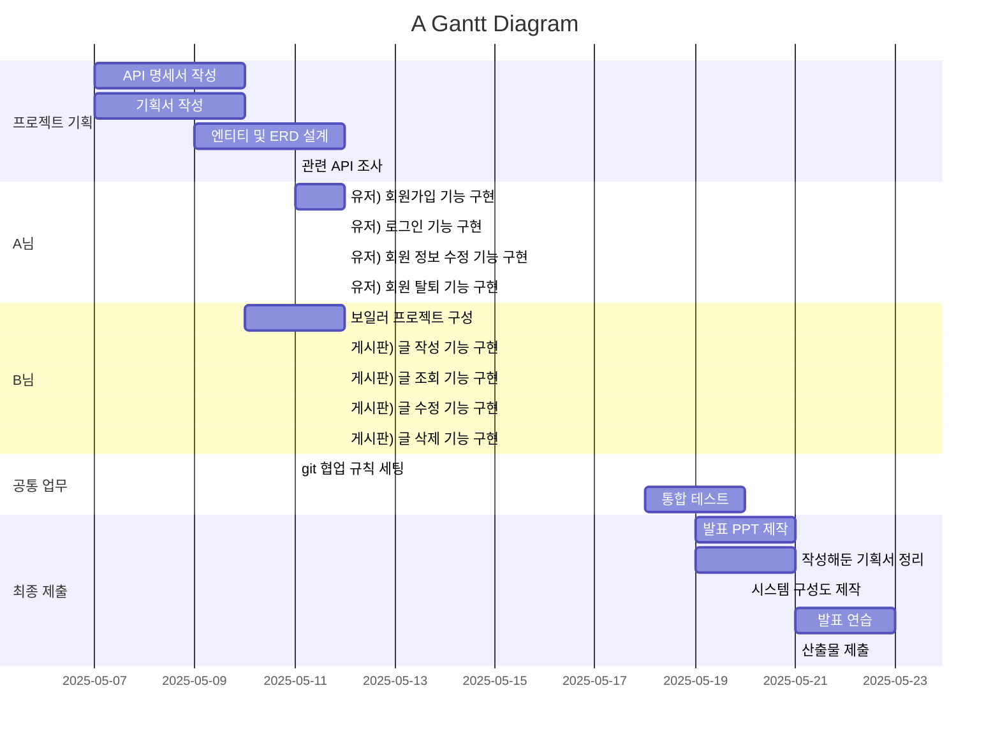

<h1 align="left">Hi 👋, I'm Sunjung</h1>
<h3 align="left">A passionate backend developer from South Korea</h3>

---

<h3 align="left">🛠️ Tech Stack</h3>

  
  
  
  
  
  
  
  
  
  
  
  
  

---

<h3 align="left">🎓 Education</h3>

  🏫 <strong>SSAFY (Samsung Software Academy for Youth)</strong> 
  Full-stack Software Engineering Program 
  2024.07 - 2025.02  
🏅 <em>1학기 성적우수상 (2등)</em> 
  🏅 <em>2학기 공통PJT (Scentify : 사용자 맞춤 스마트 디퓨져) (2등)</em> 

---

### 📈 GitHub Stats

   

## 📖 Gantt :fire:

